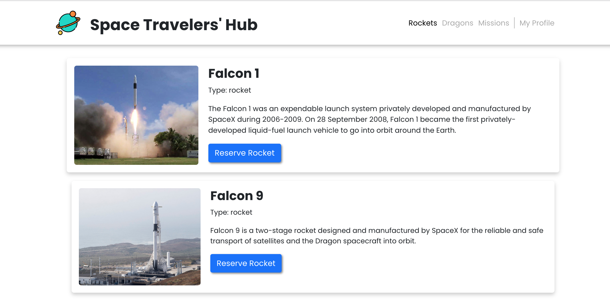

# Space Traveler's Hub

> This project is a web application for a company that provides commercial and scientific space travel services. The application will allow users to book rockets and dragons and join selected space missions. It is built by react and redux by using SpaceX API.

## Built With
- HTML & CSS & JavaScript
- Html, Css & JavaScript linters
- Reactjs and Redux

## Live Demo 

[Live Demo Link](https://team-space-travelers.netlify.app/)

## Getting Started

This project was bootstrapped with [Create React App](https://github.com/facebook/create-react-app).

- clone the repository by running\
    `git clone https://github.com/selma-belhadj/space-travelers.git`
- navigate to the folder\
    `cd space-travelers`
- Install packages\
    `npm install`
- Run the app\
    `npm start`
- Eject the app\
    `npm run eject`
- Create build app\
    `npm run build`
- Test Linters app\
    `npm run check-linters`

## Authors

👤 **Selma Belhadj**

- GitHub: [@selma-belhadj](https://github.com/selma-belhadj)
- LinkedIn: [@selma-belhadj](https://www.linkedin.com/in/selma-belhadj/)

👤 **Awais Amjed**

- GitHub: [@awais-amjed](https://github.com/awais-amjed)
- LinkedIn: [@awais-amjed](https://www.linkedin.com/in/awais-amjed/)

👤 **Radmila Stojceva**

- GitHub: [@M0rrighan](https://github.com/M0rrighan)
- LinkedIn: [@radmila-stojceva](https://www.linkedin.com/in/radmila-stojceva/)

## 🤝 Contributing

Contributions, issues, and feature requests are welcome!

Feel free to check the [issues page](../../issues/).

## Show your support

Give a ⭐️ if you like this project!

## 📝  License
This project is [MIT](./MIT.md) licensed.
